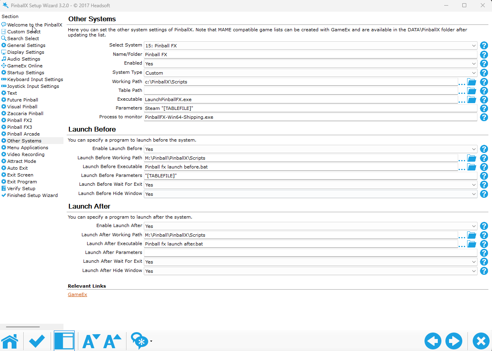

# Pinball FX Launcher 
[](https://github.com/joyrider3774/PinballFXLauncher/releases "Download Latest Version") 

> **Warning**
> THIS IS DEPRECATED PINBALL FX SUPPORTS DIRECT LAUNCH NOW !!! SEE THIS URL https://www.pinballfx.com/?page_id=7754, You can still use the media, I have renamed all media to the names the game uses (so a numeric value filename)

## Media Preview:
- [Tarcisio Wheels](TarcisioWheelsPreview.md)
- [Docklet Wheels](DockletWheelsPreview.md)
- [Backglasses](BackglassesPreview.md)
- [Tables](TablesPreview.md)

-------------------------------------------------------------------------------------------------------------------------------------------------------------------------

EVERYTHING BELOW IS DEPRECATED see https://www.pinballfx.com/?page_id=7754

-------------------------------------------------------------------------------------------------------------------------------------------------------------------------

A Launch Autohotkey script for pinball FX that adds per table launching support. Plus a collection of docklet wheel images that go with it

> **Warning**
> It seems the order the tables appear in the game can vary between users even on the same platform and they are definatly different between multiple platforms like for example steam and epic. So i will only add the new tables to the script and update the table databases for easy import and adapt the script to my positions. This means you will have to modify the positions inside the autohotkey script yourself, based on how the tables appear in your install of the game when having a specific group selected! They might also change with each update that Zen releases!

## Release / Help Video

### Script install / usage instructions (see this first)
[](https://youtu.be/_XECsVwUTlI "Pinball FX Launcher V1.0 Helper Video")

### Pinup Popper install instructions
[](https://youtu.be/XlcSQ_hOWcA "Pinball FX Launcher Pinup Popper Helper Video")


## Usage
Compile To Exe (check video above) then use these commands

### For Epic Games game version:
```
LaunchPinballFX.exe [TableName] [Mode]
```

### For Steam game version:
```
LaunchPinballFX.exe Steam [TableName] [Mode]
```


Where `[TableName]` is the name of the table and `[Mode]` the game mode to play

## Game Modes
You can use any of the listed game mode values below for the `[Mode]` Parameter

- Classic
- Pro
- Arcade
- Hotseat2
- Hotseat3
- Hotseat4
- Practice
- Distance
- Time
- 1Ball
- Flips 

Pro mode is only available on Williams tables, if you select Pro Mode on another table it will use Classic Mode.
Daily Free Tables will also always start classic mode as when you don't own the tables only classic mode is availble.
If you don't Specify the game mode, it will always use classic mode

## Table Names
You can use any of the listed Table Name values below for the `[TableName]` Parameter

### Zen Original Tables
- TblAdventureLand
- TblBioLab
- TblCastleStorm
- TblCurseOfTheMummy
- TblGrimTales
- TblSorcerersLair
- TblPasha
- TblPinballNoir
- TblRome
- TblSecretsOfTheDeep
- TblSkyPirates
- TblSonOfZeus
- TblWildWest
- TblWrathOfTheElderGods

### Bace Yourself Pinball Tables
- TblCryptOfTheNecroDancer

### DreamWorks Tables
- TblDragonsPinball
- TblKungFuPandaPinball
- TblTrollsPinball

### Hasbro Tables
- TblMyLittlePony

### Legendary Tables
- TblGodzilla
- TblGodzillaVsKong
- TblKong

### Gearbox Tables
- TblBorderlands
- TblBrotherInArms
- TblHomeWorld

### Marvel Tables
- TblMVAntman
- TblMVAvengers
- TblMVAvengersAgeOfUltron
- TblMVBlade
- TblMVCaptainAmerica
- TblMVCivilWar
- TblMVDeadPool
- TblMVDrStrange
- TblMVFantasticFour
- TblMVFearItself
- TblMVGhostRider
- TblMVGuardiansOfTheGalaxy
- TblMVInfinityGauntlet
- TblMVIronMan
- TblMVMoonKnight
- TblMVSpiderMan
- TblMVThor
- TblMVVenom
- TblMVWolverine
- TblMVWomenOfPowerAForce
- TblMVWomenOfPowerChampions
- TblMVXMen
- TblMVWorldWarHulk

### Paramount Tables
- TblWorldWarZ

### Peanuts Tables
- TblSnoopyPinball

### Star Wars Tables
- TblSWAhchToIsland
- TblSWBattleOfMimban
- TblSWBobaFett
- TblSWCalrissianChronicles
- TblSWClassicCollectibles
- TblSWCloneWars
- TblSWDarthVader
- TblSWDroids
- TblSWEmpireStrikesBack
- TblSWForceAwakens
- TblSWHanSolo
- TblSWMandalorian
- TblSWMastersOfTheForce
- TblSWMightOfTheFirstOrder
- TblSWNewHope
- TblSWRebels
- TblSWReturnOfTheJedi
- TblSWRogueOne
- TblSWSolo
- TblSWStarfighterAssault
- TblSWTheLastJedi

### Universal Tables
- TblBackToTheFuture
- TblET
- TblJaws
- TblJurassicParkPinball
- TblJurassicParkPinballMayhem
- TblJurassicWorld

### Williams Tables
- TblArabianNights
- TblAttackFromMars
- TblBlackRose
- TblChampionPub
- TblCirqusVoltaire
- TblCreatureOfTheBlackLagoon
- TblDrDude
- TblFishTales
- TblFunHouse
- TblHurricane
- TblIndianaJones
- TblJunkYard
- TblMedievalMadness
- TblMonsterBash
- TblNoGoodGofers
- TblPartyZone
- TblRoadShow
- TblSafeCracker
- TblSpaceStation
- TblSwordsOfFury
- TblTheAddamsFamily
- TblTheGetAway
- TblTheMachineBrideOfPinBot
- TblTheatreOfMagic
- TblTwilightZone
- TblWhiteWater
- TblWorldCupSoccer

### Nickelodeon Tables
- TblGarfieldPinball

## Cabinet setup pinball X

### Pinball X Settings 
compile the provided script to an EXE and make sure it's working then use these settings:

#### Epic


#### Steam


### Launch before & After script
> **Warning**
> These are no longer needed, you can rotate the playfield inside the game now! They are only kept for reference in case someone wants to rotate the screen externally!

You will need a launch before to run some program to rotate your screen to portrait mode. I personally use irotate

Launch before (bat):
```
powershell -Command "Start-Process 'irotate.exe' '/2:rotate=90 /exit' -Verb runAs -WorkingDirectory 'C:\Program Files (x86)\iRotate\'"
```

Launch After (bat):
```
powershell -Command "Start-Process 'irotate.exe' '/2:rotate=0 /exit' -Verb runAs -WorkingDirectory 'C:\Program Files (x86)\iRotate\'"
```

## Cabinet setup pinball X using my Launcher app


You can also use my [pinball launcher app (Epic)](https://github.com/joyrider3774/PinballX_Launcher_app/tree/master/other_games/Pinball%20FX) or [pinball launcher app (Steam)](https://github.com/joyrider3774/PinballX_Launcher_app/tree/master/other_games/Pinball%20FX%20Steam) with a specific ini file for this launch script to select all the new game modes more easily if your frontend does not support selecting these by default. I think pinup popper does have these options, but pinball x/y does not.

## Cabinet setup Pinup Popper

### Popper Settings 
compile the provided script to an EXE and make sure it's working then add a new emulator using these settings and import the games from [exported game](https://raw.githubusercontent.com/joyrider3774/PinballFXLauncher/main/Databases/Popper/Export_Pinball%20FX.pupgames) list i made (Use right click save as)


### Launch Script
```
@echo off

REM You can rotate your screen inside the game now lines below are no longer needed!
REM Change /device 1 to your device id for your playfield screen
REM START "" "[STARTDIR]Launch\display.exe" /device 1 /rotate 90

timeout 2

REM backglass Videos from popper seems to stop playing sometimes when activating cabinet mode in the game
REM so this is a workaround to using ffplay.exe from ffmpeg to replay the videos, ffplay seems unaffected
REM by this problem so replaying the videos through that will work 
REM Remove REM below and make sure you have ffplay.exe in the launch directory and have adapted position
REM settings for your backglass position
REM start /min "" "[STARTDIR]Launch\ffplay.exe" -left 1080 -top 0 -x 1920 -y 1080 -alwaysontop -noborder -loop 0 "[MEDIADIR]backglass\[GAMENAME].mp4"


REM if you prefer classic mode also for williams tables set PRO on Next line below to Classic

SET ALTPARAM=Pro
if "[ALTMODE]"=="Classic" (SET ALTPARAM=Classic )
if "[ALTMODE]"=="Pro" (SET ALTPARAM=Pro )
if "[ALTMODE]"=="Arcade" (SET ALTPARAM=Arcade )
if "[ALTMODE]"=="Hotseat2" (SET ALTPARAM=Hotseat2 )
if "[ALTMODE]"=="Hotseat3" (SET ALTPARAM=Hotseat3 )
if "[ALTMODE]"=="Hotseat4" (SET ALTPARAM=Hotseat4 )
if "[ALTMODE]"=="1Ball" (SET ALTPARAM=1Ball )
if "[ALTMODE]"=="Time" (SET ALTPARAM=Time )
if "[ALTMODE]"=="Distance" (SET ALTPARAM=Distance )
if "[ALTMODE]"=="Flips" (SET ALTPARAM=Flips )
if "[ALTMODE]"=="Practice" (SET ALTPARAM=Practice )

REM for steam version (default)
START "" "[DIREMU]\LaunchPinballFX.exe" Steam [GAMENAME] %ALTPARAM%

REM For Epic Games Version remove REM from command below and put a REM before the command above
REM START "" "[DIREMU]\LaunchPinballFX.exe" [GAMENAME] %ALTPARAM%

timeout 5

START "" "[STARTDIR]Launch\VPXSTARTER.exe" 10 10 60 "PinballFX"

```

### Close Script
```
REM you can change the rotation inside the game now line below is no longer needed
REM START "" "[STARTDIR]Launch\display.exe" /device 1 /rotate 0
timeout 2
"[STARTDIR]LAUNCH\PUPCLOSER.EXE" WINTIT "PinballFX" 5 1
timeout 1
taskkill /f /im epicgameslauncher.exe
taskkill /f /IM ffplay.exe
```

## Credits:
- stang-retro geradg: Adding tags and manufactors to pinup popper database as well as playtesting the script in pinup popper
- Docklet logo's are taken randomly from internet and what i had on my pinball cabinet for pinball FX3
- Docklet images themselves mostly come from the backglasses from [this dropbox link](https://www.dropbox.com/sh/l4so158sh8s2ewx/AACO7ZCV5LAOw2I_fORzspZ5a/Cabinet?dl=0&subfolder_nav_tracking=1)
- Docklet template comes from pinball x forums from the zaccaria docklet wheel topic
- Tarcisio wheel image used template from [NailBuster](https://www.nailbuster.com/pup/tar_wheel.png)
- script uses eval function made by Pulover [Rodolfo U. Batista] and by Uberi (ExprEval())
- Table Images i made myself using the screenshot function from [Pinball X](https://www.pinballx.com/)
- Backglass images were initially taken from [this dropbox link](https://www.dropbox.com/sh/l4so158sh8s2ewx/AACO7ZCV5LAOw2I_fORzspZ5a/Cabinet?dl=0&subfolder_nav_tracking=1)
- Certain backglasses are intially made by "TheTrainGoes" see his github [here](https://github.com/TheTrainGoes/Pinball-FX3-Backglass) 
- Certain backglasses are from promotional images from Zen Studios.
- I Edited certain backglasses, i tried to either remove PFX2/3 logos or replace it with a pinball FX Logo
- On certain other backglasses i added a "Table" logo as i prefer to see the table names in the backglasses.
